# crump

**Project management for AI coding agents.**

You plan. Agents execute. crump handles the pipeline.

## Why

I was building a large project with Claude Code and kept hitting the same problem: I'd describe what I wanted, Claude would start coding, and by the time it was done I'd already changed my mind about the approach. Planning and execution were tangled together. I tried `task.md` files, but managing markdown doesn't scale — it's hard to see what you have, hard to track status, and the agent keeps losing context.

So I built crump. The idea is simple: **separate planning from execution**.

You work with a lead agent in an interactive session — creating features, breaking them into tasks, writing requirements. Meanwhile, in another terminal, a worker agent picks up approved tasks, writes code, opens PRs, and waits for merge. You're planning task #5 while the agent is coding task #2.

Both sessions talk to the same server. When the worker finishes a task, the pipeline advances it. When you create a new task, the worker picks it up on the next sweep. It's like pair programming where your partner never gets tired and never loses context.

## Install

### Prerequisites

- [Claude Code](https://claude.ai/code)
- [GitHub CLI](https://cli.github.com/) — authenticated (`gh auth login`)
- A GitHub repository

### 1. Install the Claude Code plugin

```bash
claude plugin marketplace add https://github.com/etra/crump-claude
claude plugin install crump@crump-plugins
```

### 2. Download the crump binary

```bash
curl -fsSL https://raw.githubusercontent.com/etra/crump-claude/main/install-crump.sh | bash
```

Or download from the [latest release](https://github.com/etra/crump-claude/releases/latest):

| Platform | Binary |
|----------|--------|
| macOS (Apple Silicon) | `apple-aarch64` |
| macOS (Intel) | `apple-x86_64` |
| Linux (x86_64) | `linux-x86_64` |
| Windows (x86_64) | `windows-x86_64` |

---

## Demo

[](https://youtu.be/eoWbNVz3LYM)

> **10 min demo** — creating tasks in an interactive session, watching the worker loop implement them, PRs opening automatically, merging, and the full pipeline flow end-to-end.

---

## Architecture

crump uses a server/client architecture. The server owns the database, pipeline state machine, and git operations (via GitHub API). Clients connect via transport (Unix socket or WebSocket) and execute work locally.

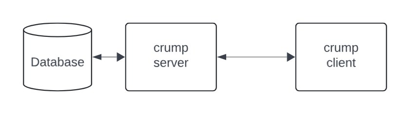

### Clients

| Client | What it does |
|--------|-------------|
| **Interactive Agent** | You + lead agent plan the project — create features, tasks, write requirements |
| **Loop Agent** | Automated worker — picks up tasks, spawns Claude to write code, signals completion |
| **Web Dashboard** | Read-only pipeline view — task status, feature progress, audit log |
| **Slack Agent** | *(coming soon)* — notifications and commands via Slack |

---

## Quick Start

### Step 1: Initialize the workspace (server)

```bash
crump workspace init
```

The wizard walks you through storage, transport, GitHub token, and pipeline configuration.

| Start | Summary |
|:---:|:---:|
| 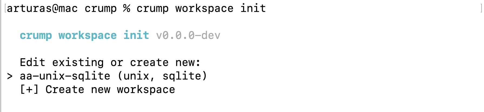 | 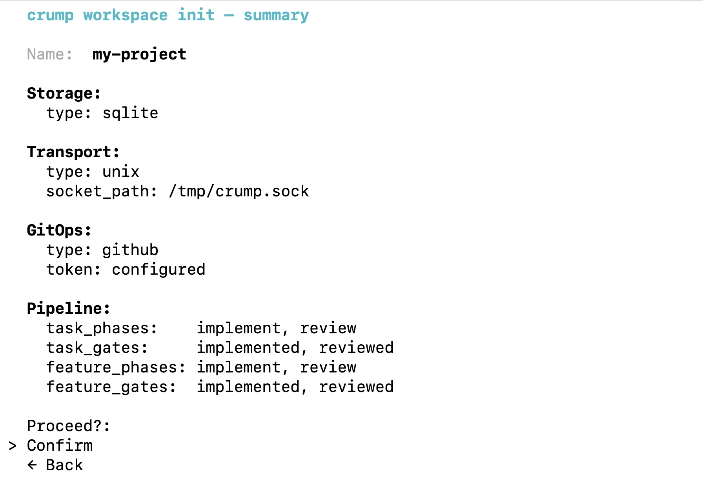 |

### Step 2: Add projects

```bash
crump workspace project
```

Select GitHub repositories from your account. Each project maps to a git repo that agents work in.

### Step 3: Start the server

```bash
crump server start
```

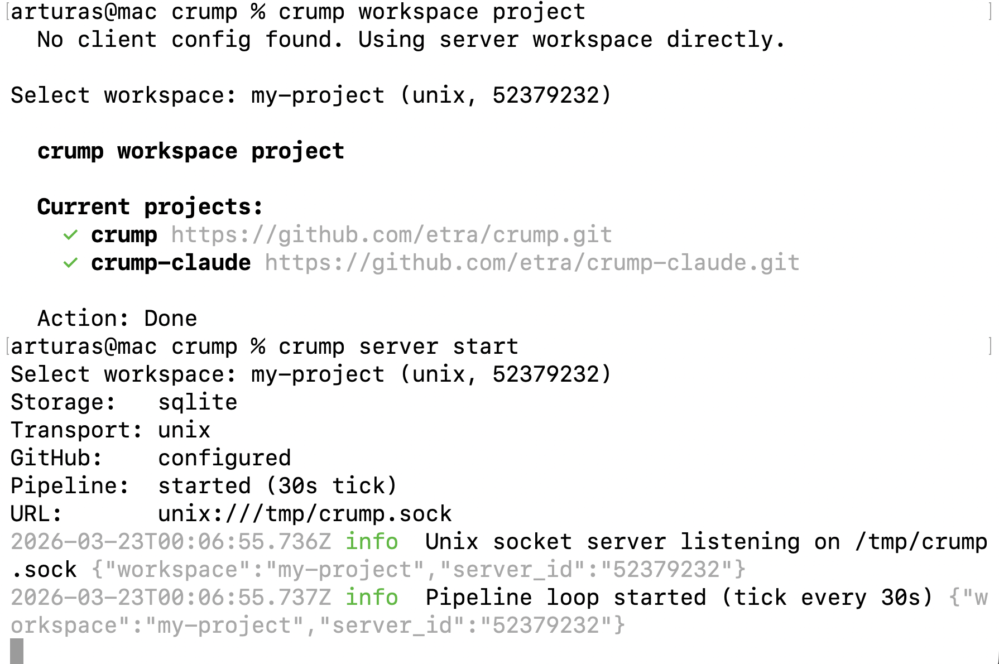

The server starts the transport listener and pipeline loop. Leave this running.

### Step 4: Generate a join token

```bash
crump workspace token
```

Copy the token — clients use it to connect.

### Step 5: Join from a client machine (or another terminal)

```bash
cd ~/your-project
crump workspace join
```

Paste the token. Map server projects to local git checkouts.

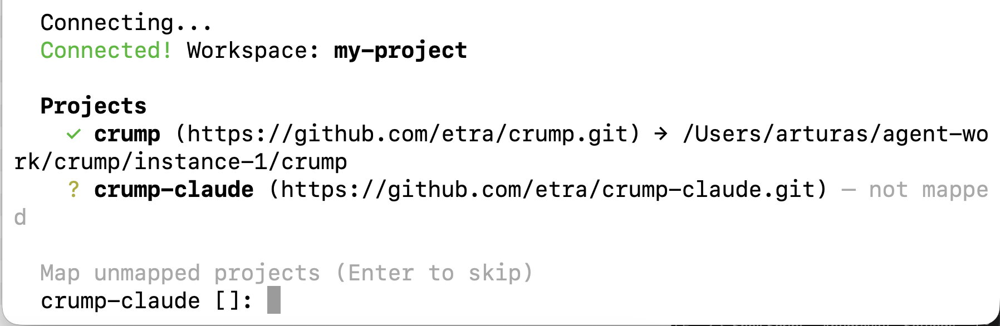

### Step 6: Start the web dashboard

```bash
crump webserver
```

Opens at `http://localhost:8080` — shows pipeline phases, task status, features, and audit log.

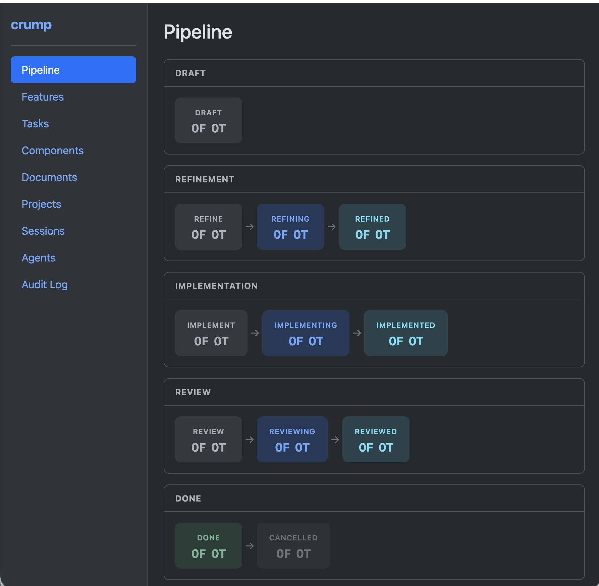

### Step 7: Start an interactive planning session

```bash
crump agent start
# Select: Interactive Agent
# Select: crump-lead
```

You and the lead agent create components, features, and tasks.

| Planning with lead agent | Components created |
|:---:|:---:|
| 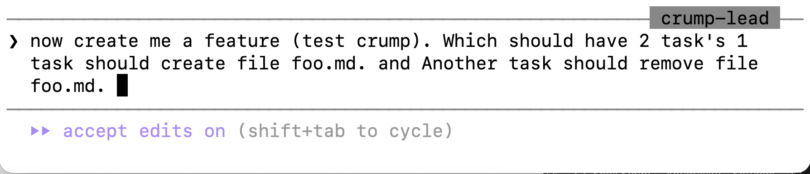 | 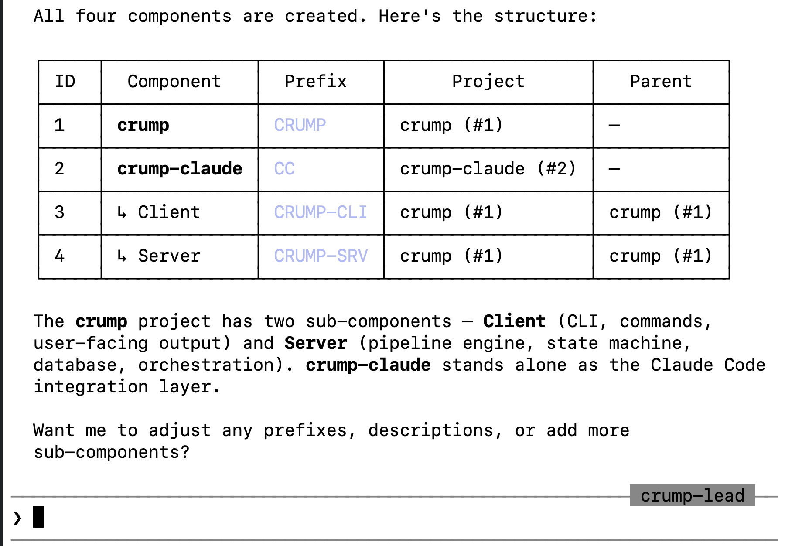 |

### Step 8: Start the worker loop

Open a **separate terminal** with its own git checkout of the project:

```bash
cd ~/agent-work/your-project
crump agent start
# Select: Loop Worker
# Select: crump-worker
```

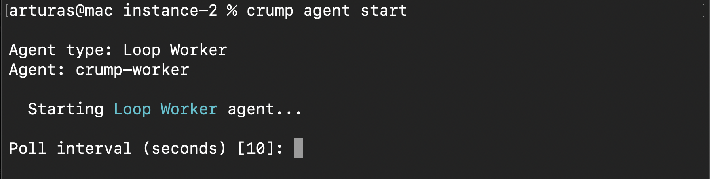

The worker picks up tasks in auto phases, spawns Claude to write code, commits, pushes, and opens PRs.

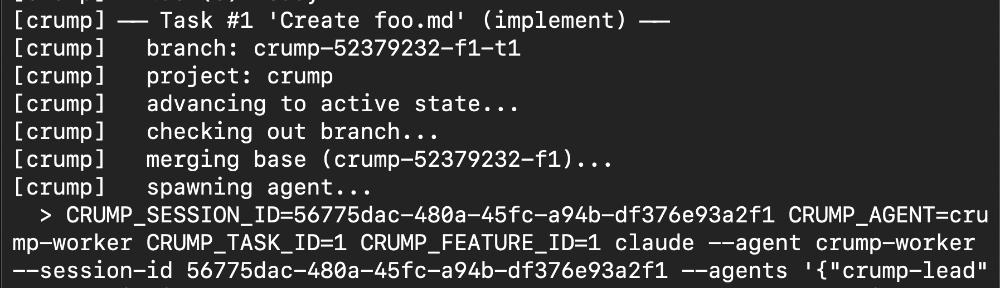

### Step 9: Review and merge

Tasks in `reviewing` have open PRs on GitHub. Review, merge, and the pipeline advances them to `done`.

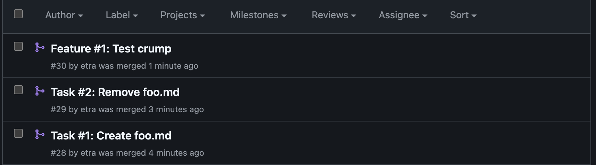

---

## Parallel Workers

For faster execution, run multiple workers with separate git checkouts:

```
~/agent-work/
  instance-1/your-project/    # Worker 1
  instance-2/your-project/    # Worker 2
  instance-3/your-project/    # Worker 3
```

Each worker joins the same server and gets assigned different tasks. Setup:

```bash
# For each instance:
cd ~/agent-work/instance-N/your-project
crump workspace join    # paste the same token, map the project
crump agent start       # select Loop Worker
```

Tasks are assigned first-come-first-served. Workers won't pick up tasks already being worked on (`implementing` state).

---

## The Pipeline

Both tasks and features flow through the same three phases. Each phase has three states:

| Phase | Pending | Active | Complete | What the agent does |
|-------|---------|--------|----------|---------------------|
| **Refine** | `refine` | `refining` | `refined` | Research codebase, write requirements and acceptance criteria |
| **Implement** | `implement` | `implementing` | `implemented` | Write code, add tests, verify build passes |
| **Review** | `review` | `reviewing` | `reviewed` | Review PR, check acceptance criteria, approve or request changes |

A new task starts in `draft`. After all three phases complete, it moves to `done`.

### Who does what

| Transition | Responsibility |
|---|---|
| `draft` → `refine` | Server pipeline tick (automatic gate) |
| `refine` → `refining` | Agent loop (picks up task, starts work) |
| `refining` → `refined` | Agent (signals completion) |
| `refined` → `implement` | Server pipeline tick (automatic gate) |
| `implement` → `implementing` | Agent loop (picks up task, starts work) |
| `implementing` → `implemented` | Agent (signals completion with summary) |
| `implemented` → `review` | Server pipeline tick (automatic gate) |
| `review` → `reviewing` | Agent loop (picks up task, opens PR) |
| `reviewing` → `reviewed` | Server (detects PR merge) |
| `reviewed` → `done` | Server pipeline tick + PR merge |

### Auto vs Manual phases

Each phase can be **auto** (worker loop handles it) or **manual** (you control it). Configure during `crump workspace init`.

Default: implementation and review are auto. Refinement is manual — you write the requirements.

### Features

Features group related tasks. A feature has its own pipeline:

1. **Refine** — lead agent breaks the feature into tasks
2. **Implement** — waits for all tasks to complete, then validates the feature branch
3. **Review** — opens a feature PR to main, reviews combined changes

Task PRs merge into the **feature branch**. The feature PR merges into **main**. This keeps main clean until the entire feature is validated.

### Git branching

```
main
  └── crump-{uid}-f{feature_id}              # feature branch
        ├── crump-{uid}-f{fid}-t{task_id_1}  # task 1 branch
        └── crump-{uid}-f{fid}-t{task_id_2}  # task 2 branch
```

Standalone tasks (no feature) branch directly from main: `crump-{uid}-t{task_id}`

---

## Commands

### Workspace

```bash
crump workspace init      # Create server workspace (interactive wizard)
crump workspace token     # Generate handshake token for clients
crump workspace join      # Connect client to server using token
crump workspace project   # Add/remove GitHub repositories
```

### Server

```bash
crump server start        # Start the server (transport + pipeline loop)
```

### Agents

```bash
crump agent start         # Start an agent (interactive setup)
crump agent list          # List configured agents
```

### Web Dashboard

```bash
crump webserver           # Start read-only web dashboard
```

### Direct entity commands

```bash
crump exec '<json>'                     # Execute JSON protocol commands
crump <entity> <action> [--args]        # Direct CLI (alternative to JSON)
```

---

## Entity Reference

| Entity | Purpose |
|--------|---------|
| **task** | Work items — smallest unit of work |
| **feature** | High-level deliverables grouping tasks |
| **component** | Modules/subsystems (backend, auth, UI) with tree hierarchy |
| **project** | Git repositories (name + origin) |
| **document** | Specs, design docs, reference material |
| **comment** | Threaded discussion on tasks/features |
| **workspace** | Top-level config (singleton) |

### Task actions

| Action | Input | What it does |
|--------|-------|-------------|
| `draft` | `{title, component_id, feature_id?, body?}` | Create a task |
| `refine` | `{title, component_id, ...}` | Create and queue for refinement |
| `implement` | `{title, component_id, ...}` | Create ready for implementation |
| `get` | `{id}` | Get task by ID |
| `list` | `{}` | List all tasks |
| `filter` | `{status?, feature_id?, component_id?}` | Filter tasks |
| `update` | `{id, title?, body?, depends_on?}` | Update fields |
| `advance` | `{id}` | Advance to next state |
| `move` | `{id, target}` | Move to any state (forward or backward) |
| `refined` | `{id}` | Signal: refinement complete |
| `implemented` | `{id, summary}` | Signal: implementation complete |
| `reviewed` | `{id}` | Signal: review complete |
| `block` | `{id, reason}` | Block with reason |
| `unblock` | `{id}` | Clear blocked flag |
| `reset` | `{id, reset_to?}` | Reset to previous state |
| `cancel` | `{id}` | Cancel the task |
| `prompt` | `{id, branch?}` | Build agent prompt |

### Examples

```bash
# Create a task
crump exec '{"entity":"task","action":"draft","data":{"title":"Add login page","feature_id":1,"component_id":2}}'

# Write requirements and signal done
crump exec '{"entity":"task","action":"update","data":{"id":1,"body":"## Context\n..."}}'
crump exec '{"entity":"task","action":"refined","data":{"id":1}}'

# Signal implementation done
crump exec '{"entity":"task","action":"implemented","data":{"id":1,"summary":"Added JWT auth with login endpoint"}}'

# Move to any state
crump exec '{"entity":"task","action":"move","data":{"id":1,"target":"draft"}}'

# Block a task
crump exec '{"entity":"task","action":"block","data":{"id":1,"reason":"Waiting for API spec"}}'

# Or use the CLI directly
crump task draft --title "Add login page"
crump task list
crump task get --id 1
```

---

## Transport

crump supports two transport types between server and clients:

### Unix Socket (default)

Fast, zero-config, single-machine. Communicates via `/tmp/crump.sock`.

Best for: local development, single machine with multiple terminals.

### WebSocket

*Documentation coming soon.* Supports TLS, authentication tokens, and remote connections.

Best for: multi-machine setups, remote workers.

---

## Storage

### SQLite (default)

Zero-config, stores data in a local file. Recommended for most setups.

### PostgreSQL

*Documentation coming soon.* For teams and production deployments.

---

## Built-in Agents

| Agent | Permission Mode | Purpose |
|-------|----------------|---------|
| `crump-lead` | `acceptEdits` | Interactive planning — create features, tasks, write requirements |
| `crump-worker` | `bypassPermissions` | Automated execution — write code, run tests, signal completion |

Custom agents can be added via `crump agent add`.

---

## How It Works

1. **Server** owns the database, pipeline state machine, and GitHub API operations (branch creation, PR management, merge)
2. **Pipeline loop** runs on the server every 30s — advances gate transitions (refined→implement, implemented→review, reviewed→done) and polls PR merge status
3. **Agent loop** (client) asks server for work items, advances pending→active, spawns Claude with a context-rich prompt, commits/pushes after agent exits
4. **Auto-reconnect** — clients reconnect automatically if the server restarts (exponential backoff, up to 5 retries)
5. **Audit trail** — every action is logged with timestamps, session IDs, and actor identity

---

## Documentation

- [Installation](docs/installation.md) — full setup for all platforms
- [How It Works](docs/how-it-works.md) — pipeline, state machine, git operations
- [Plugin Structure](docs/plugin-structure.md) — what's in the Claude Code plugin
- [Updating](docs/updating.md) — how to update binary and plugin

---
