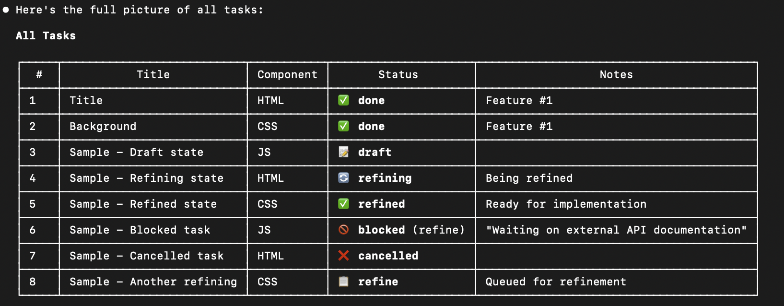
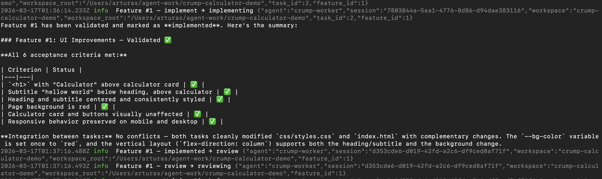
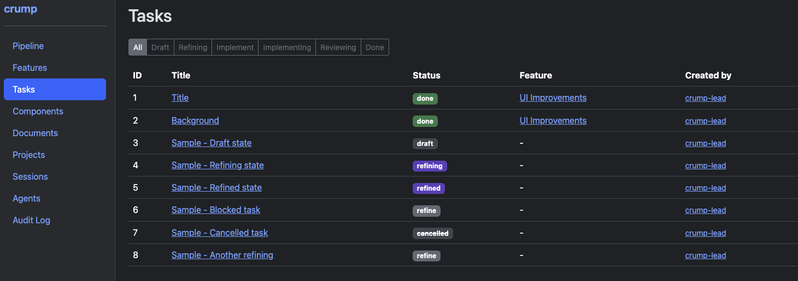
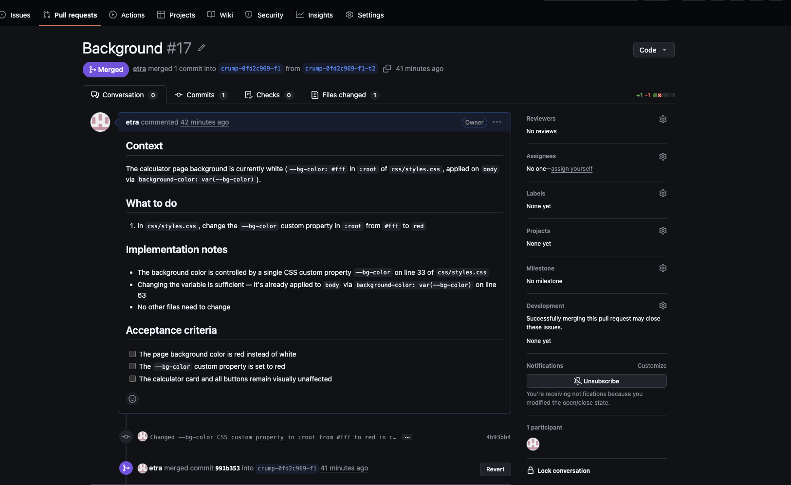
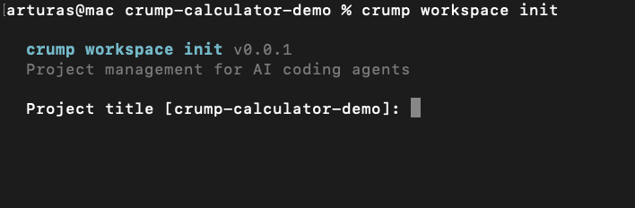
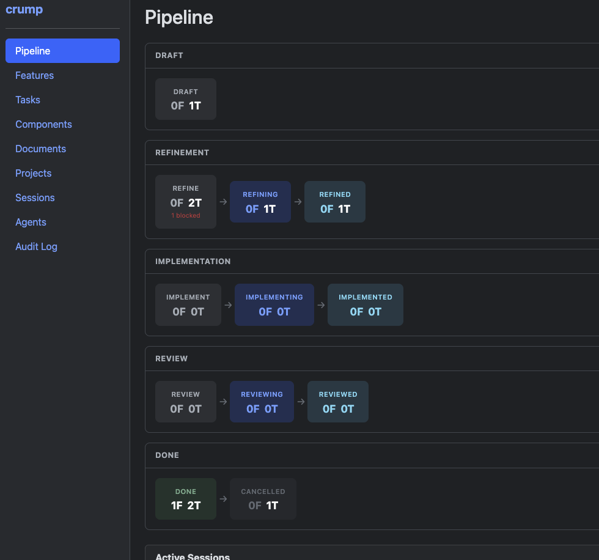

# crump

**Project management for AI coding agents.**

You plan. Agents execute. crump handles the pipeline.

## Install

### Prerequisites

- [Claude Code](https://claude.ai/code)
- [Git](https://git-scm.com/) with a GitHub remote
- [GitHub CLI](https://cli.github.com/) — authenticated (`gh auth login`)

### 1. Install the Claude Code plugin

```bash
claude plugin marketplace add https://github.com/etra/crump-claude
claude plugin install crump@crump-plugins
```

### 2. Download the crump binary

Use the install script (macOS/Linux):

```bash
curl -fsSL https://raw.githubusercontent.com/etra/crump-claude/main/install-crump.sh | bash
```

Or download manually from the [latest release](https://github.com/etra/crump-claude/releases/latest) and place the binary in your PATH (e.g. `~/.local/bin/crump`).

| Platform | Binary |
|----------|--------|
| macOS (Apple Silicon) | `apple-aarch64` |
| macOS (Intel) | `apple-x86_64` |
| Linux (x86_64) | `linux-x86_64` |
| Windows (x86_64) | `windows-x86_64` |

---

## Demo

[](https://youtu.be/eoWbNVz3LYM)

> **10 min demo** — creating tasks in an interactive session, watching the worker loop implement them, PRs opening automatically, merging, and seeing the full pipeline flow end-to-end.

---

## The story

I wanted to build a large project with Claude Code — but I kept running into the same problem: I'd describe what I wanted, Claude would start coding, and by the time it was done I'd already changed my mind about the approach. Planning and execution were tangled together.

So I built crump. The idea is simple: **separate planning from execution**.

I work in an interactive session with a lead agent — we create features, break them into tasks, write requirements, discuss the approach. Meanwhile, in another terminal, a worker agent picks up the tasks I've already approved and implements them. I'm planning task #5 while the agent is coding task #2.

Both sessions share the same database. When the worker finishes a task, I get a notification. When I create a new task, the worker picks it up on the next sweep. It's like pair programming where your partner never gets tired.

crump started as a simple CRUD for tasks and features. Then it grew: a pipeline with state machines, git automation (branches, commits, PRs), a web dashboard, notifications between sessions, and a loop that orchestrates everything. But at its core, it's still just a way to say "here's what I want done" and have an agent do it.

---

## What it looks like

| Planning session | Worker loop |
|:---:|:---:|
|  |  |

| Web dashboard | PR created |
|:---:|:---:|
|  |  |

### The setup

<table>
<tr>
<td>

```
┌──────────────────────────────┐
│ Terminal 1: Planning session │
│                              │
│ You + lead agent             │
│ ├── Create features & tasks  │
│ ├── Write requirements       │
│ ├── Review agent's work      │
│ └── Approve PRs              │
│                              │
│ ~/work/my-project/           │
└──────────────────────────────┘
```

</td>
<td align="center">

```
      ┌─────────────────┐
 ◀──  │ Shared database  │  ──▶
      │ (notifications)  │
      └─────────────────┘
```

</td>
<td>

```
┌──────────────────────────────┐
│ Terminal 2: Worker loop      │
│                              │
│ Automated agent execution    │
│ ├── Picks up approved tasks  │
│ ├── Creates branches         │
│ ├── Writes code              │
│ ├── Opens PRs                │
│ └── Waits for merge → done   │
│                              │
│ ~/work/my-project-worker/    │
└──────────────────────────────┘
```

</td>
</tr>
</table>

### The pipeline

<table>
<tr>
<th align="center">You (planning)</th>
<th align="center"></th>
<th align="center">Worker (auto)</th>
</tr>
<tr>
<td>

```
 Create task
      │
      ▼
 ┌──────────┐
 │  draft   │
 └──────────┘
      │
 Write requirements
      │
      ▼
 ┌──────────┐
 │ refined  │
 └──────────┘
      │
      ▼
 advance to
 implement
```

</td>
<td align="center">

```
  ──▶
```

</td>
<td>

```
       ┌─────────────┐
       │ implementing │
       └─────────────┘
             │
       create branch
        write code
       commit + push
             │
             ▼
       ┌─────────────┐
       │  reviewing   │
       └─────────────┘
             │
         open PR
```

</td>
</tr>
<tr>
<td>

```
 Review PR on GitHub
 Merge PR
      │
      ▼
 ┌──────────┐
 │   done   │
 └──────────┘
```

</td>
<td align="center">

```
  ◀──
```

</td>
<td>

```
 Detects PR merged
 Advances task
```

</td>
</tr>
</table>

Every task flows through three phases. Each phase has three states:

| Phase | Pending | Active | Complete | What happens |
|-------|---------|--------|----------|--------------|
| **Refine** | `refine` | `refining` | `refined` | Write requirements |
| **Implement** | `implement` | `implementing` | `implemented` | Create branch, write code, commit + push |
| **Review** | `review` | `reviewing` | `reviewed` | Open PR, wait for merge |

A new task starts in `draft`. After the final phase completes, it moves to `done`.

Each phase can be **auto** (worker loop handles it) or **manual** (you control it). By default, implementation is auto — you plan, agents code.

---

## Quick start

### 1. Create a workspace

```bash
cd your-project
crump workspace init
```



You'll be guided through:
- Project title
- Project layout (single repo or multi-repo)
- Pipeline phases (which are auto vs manual)

### 2. Set up the worker directory

Clone your repo a second time for the worker:

```bash
git clone <your-repo-url> ~/work/my-project-worker
cd ~/work/my-project-worker
crump workspace attach  # select the workspace you just created
```

### 3. Start planning

```bash
# Terminal 1
crump start planning --agent crump-lead
```

The lead agent helps you create components, features, tasks, and write requirements. Everything stays in `draft` until you explicitly advance it.

### 4. Start the worker loop

```bash
# Terminal 2
crump start loop --agent crump-worker --poll 10
```


Select `bypassPermissions` when prompted (agents need file access). The loop will:
- Pick up tasks in auto phases
- Create git branches
- Spawn worker agents to write code
- Commit, push, open PRs
- Wait for PR merges

### 5. Review and merge

Tasks in `reviewing` have an open PR. Review it on GitHub, merge it, and the loop advances the task to `done`.

---

## Pipeline dashboard

```bash
crump webserver
```



Opens at `http://localhost:8080` — shows pipeline view, task details, feature progress, audit log.

---

## Entities

crump manages these entities via `crump exec`:

| Entity | Purpose | Key actions |
|--------|---------|-------------|
| **task** | Work items — what agents implement | `draft`, `refine`, `implement`, `advance`, `refined`, `implemented`, `reviewed` |
| **feature** | Groups tasks into deliverables | `draft`, `refine`, `advance`, `refined`, `implemented`, `reviewed` |
| **component** | System areas (backend, auth, UI) | `create`, `get`, `list`, `update`, `delete` |
| **document** | Specs, design docs, reference material | `create`, `get`, `list`, `update`, `delete` |
| **comment** | Discussion on tasks/features | `create`, `get`, `list`, `update`, `delete` |
| **project** | Git repositories | `create`, `get`, `list` |
| **config** | Workspace title and summary | `get`, `save` |
| **notification** | Pipeline events | `list`, `clean` |

### Task lifecycle actions

| Action | What it does |
|--------|-------------|
| `draft` | Create a task |
| `refine` | Create a task and queue for refinement |
| `implement` | Create a task ready for implementation |
| `advance` | Move to the next state (one step) |
| `refined` | Signal: refinement done |
| `implemented` | Signal: implementation done (summary = commit message) |
| `reviewed` | Signal: review done (crump merges PR) |
| `block` | Flag as blocked with reason |
| `unblock` | Clear blocked flag |
| `reject` | Code was wrong — send back to implement |
| `reset` | Requirements wrong — send back to draft |
| `cancel` | Cancel the task |

### Examples

```bash
# Create a task
crump exec '{"entity":"task","action":"draft","data":{"title":"Add login page","feature_id":1,"component_id":2}}'

# Write requirements and signal done
crump exec '{"entity":"task","action":"update","data":{"id":1,"body":"## Context\n..."}}'
crump exec '{"entity":"task","action":"refined","data":{"id":1}}'

# Or use the CLI directly
crump task draft --title "Add login page"
crump task list
crump task get --id 1
```

---

## Workspace commands

```bash
crump workspace init           # Create a new workspace
crump workspace list           # List all workspaces
crump workspace attach         # Attach directory to existing workspace
crump workspace info           # Show workspace details
crump workspace clean          # Detach directory (keeps workspace)
crump workspace delete         # Delete workspace entirely
```

## Session modes

```bash
crump start planning   # Interactive: you + lead agent plan the project
crump start once       # One sweep: advance everything by one step, exit
crump start loop       # Continuous: keep executing until Ctrl+C
```

---

## How it works under the hood

crump creates shared state between multiple agents running on the same machine — each in its own working directory of the same project. A SQLite database stores tasks, features, and pipeline state. On top of that:

- **Git automation** — branching, commits, PRs, and merges via `gh` CLI
- **Notifications** — agents are notified of each other's progress
- **Audit trail** — every action is logged with timestamps and session IDs

---

## Documentation

- [Installation](docs/installation.md) — full setup for all platforms
- [How It Works](docs/how-it-works.md) — pipeline, state machine, git operations
- [Plugin Structure](docs/plugin-structure.md) — what's in the Claude Code plugin
- [Updating](docs/updating.md) — how to update binary and plugin

---

