# crump

**Project management for AI coding agents.**

You plan. Agents execute. crump handles the pipeline.

## Why

I fully understand that Anthropic, OpenAI, or any of the big companies will eventually build their own version of this - and probably better. I started this project before they were doing it, and I'm genuinely proud of the result. It's free to use - give it a try.

I was building a large project with Claude Code and kept hitting the same problem: I'd describe what I wanted, Claude would start coding, and by the time it was done I'd already changed my mind about the approach. Planning and execution were tangled together in the same session, competing for the same context window.

So I built crump. The idea is simple: **separate planning from execution**.

You work with a lead agent in an interactive session - creating features, breaking them into tasks, writing requirements. Meanwhile, in another terminal, a worker agent picks up approved tasks, writes code, opens PRs, and waits for merge. You're planning task #5 while the agent is coding task #2.

Both sessions talk to the same server. When the worker finishes a task, the pipeline advances it. When you create a new task, the worker picks it up on the next sweep.

---

## What it looks like

| Planning with lead agent | Worker loop executing tasks |
|:---:|:---:|
| 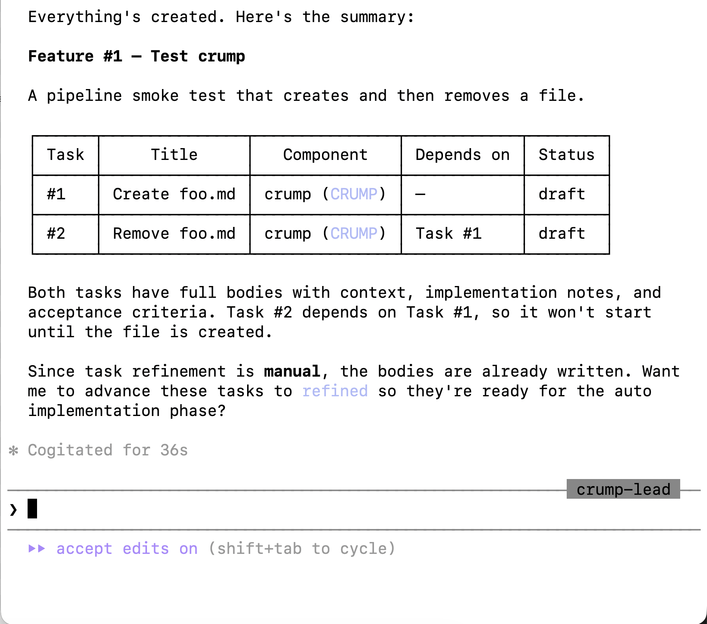 |  |

| Web dashboard - pipeline view | PRs merged on GitHub |
|:---:|:---:|
|  |  |

| Everything done | Server logs |
|:---:|:---:|
| 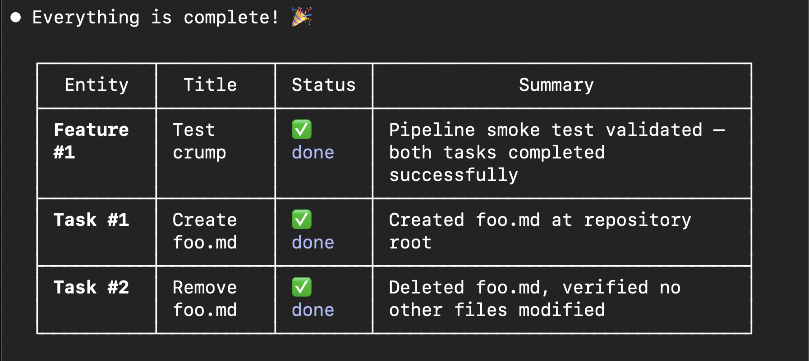 | 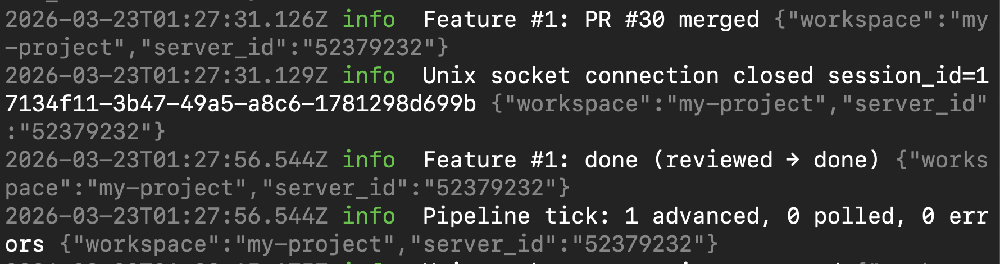 |

---

## Install

### Prerequisites

- [Claude Code](https://claude.ai/code)
- [GitHub CLI](https://cli.github.com/) - authenticated (`gh auth login`)
- A GitHub repository

### 1. Install the Claude Code plugin

```bash
claude plugin marketplace add https://github.com/etra/crump-claude
claude plugin install crump@crump-plugins
```

### 2. Download the crump binary

```bash
curl -fsSL https://raw.githubusercontent.com/etra/crump-claude/main/install-crump.sh | bash
```

Or download from the [latest release](https://github.com/etra/crump-claude/releases/latest):

| Platform | Binary |
|----------|--------|
| macOS (Apple Silicon) | `apple-aarch64` |
| macOS (Intel) | `apple-x86_64` |
| Linux (x86_64) | `linux-x86_64` |

---

## Architecture

crump uses a server/client architecture. The server owns the database, pipeline state machine, and git operations (via GitHub API). Clients connect via transport and execute work locally.


**Server** - owns data, runs the pipeline loop, manages branches and PRs via GitHub API

**Clients:**

| Client | What it does |
|--------|-------------|
| **Interactive Agent** | You + lead agent plan the project - create features, tasks, write requirements |
| **Loop Agent** | Automated worker - picks up tasks, spawns Claude, writes code, signals completion |
| **Web Dashboard** | Read-only pipeline view - task status, feature progress, audit log |
| **Slack Agent** | *(coming soon)* - check status, unblock agents, manage from Slack |

---

## Getting Started

### Step 1: Initialize the workspace

```bash
crump workspace init
```

The interactive wizard walks you through each configuration step:

**Choose storage and transport:**

| Storage | Transport |
|:---:|:---:|
| 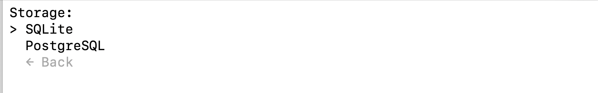 |  |

**Configure the pipeline - choose which phases are automatic:**

| Task phases | Feature phases |
|:---:|:---:|
| 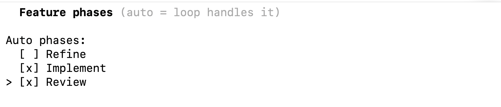 | 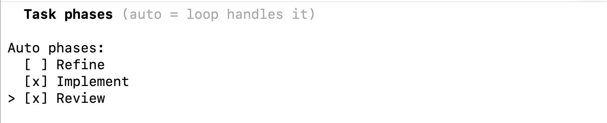 |

> **Auto** means the loop agent handles it. **Manual** means you control it. By default, implementation and review are auto - you plan, agents code.

**Review the summary and confirm:**


### Step 2: Add GitHub repositories

```bash
crump workspace project
```

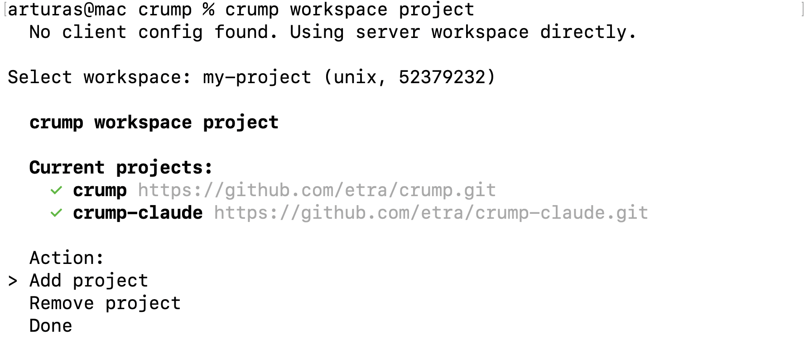

Fetches your repos via `gh` CLI. Each project maps to a git repository that agents work in.

### Step 3: Start the server

```bash
crump server start
```

| Select workspace | Server running |
|:---:|:---:|
| 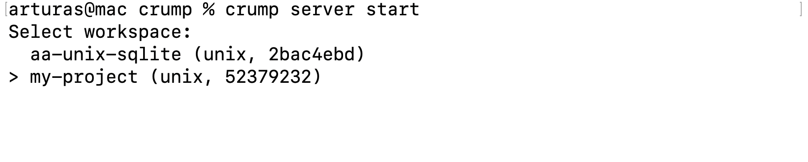 |  |

The server starts the transport listener and pipeline loop (ticks every 30s). Leave this running.

### Step 4: Generate a join token

```bash
crump workspace token
```

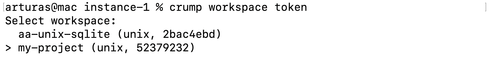

Copy the token - clients use it to connect.

### Step 5: Join from a client

In the directory where you have the project cloned:

```bash
crump workspace join
```

| Paste token | Map projects to local directories |
|:---:|:---:|
| 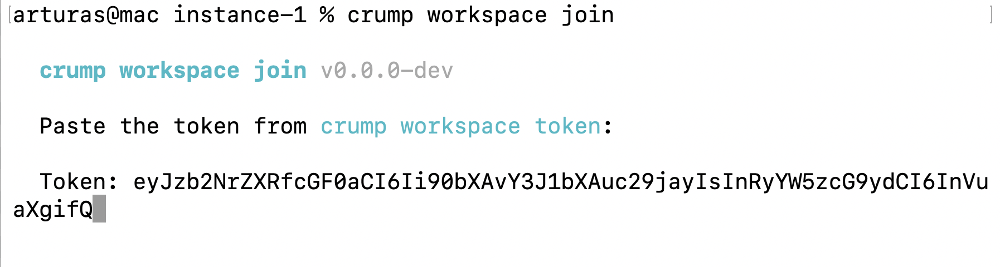 |  |

The token contains transport config (socket path, auth). You map server projects to your local git checkouts.

---

## Planning Session

Start an interactive session with the lead agent:

```bash
crump agent start
# Select: Interactive Agent
# Select: crump-lead
```

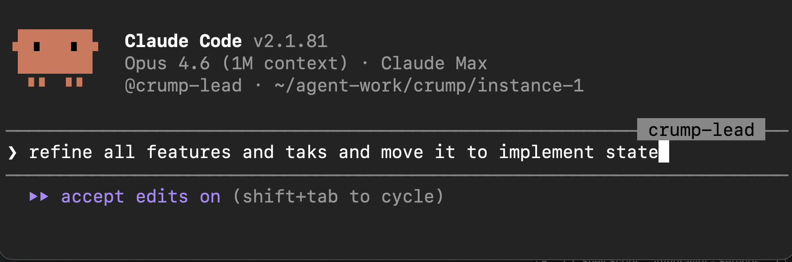

You and the lead agent discuss the project. The agent creates components, features, and tasks:

| Creating features and tasks | Components structure |
|:---:|:---:|
|  |  |

The agent presents a structured plan with task breakdown, dependencies, and component assignments:


Everything stays in `draft` until you explicitly advance it. You control what gets implemented and when.

The web dashboard shows your work in real-time:

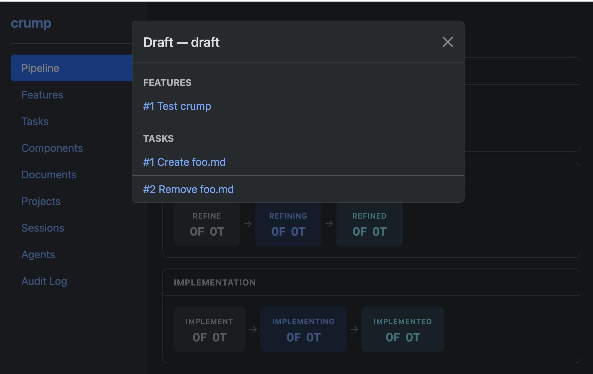

---

## Worker Loop

In a **separate terminal** with its own git checkout, start the worker:

```bash
cd ~/agent-work/instance-1/your-project
crump workspace join    # paste the same token
crump agent start
# Select: Loop Worker
# Select: crump-worker
```

| Select projects to work on | Select components |
|:---:|:---:|
| 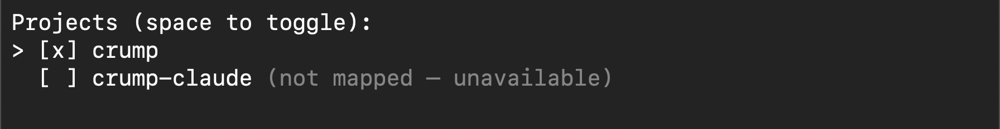 | 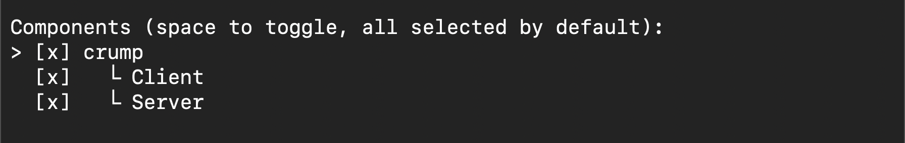 |


The worker picks up tasks in auto phases, advances them to active state, spawns Claude with a context-rich prompt (task requirements, feature context, acceptance criteria, phase instructions), and waits:


You can watch tasks progress through the pipeline in the dashboard:

| Implementing | Reviewing |
|:---:|:---:|
| 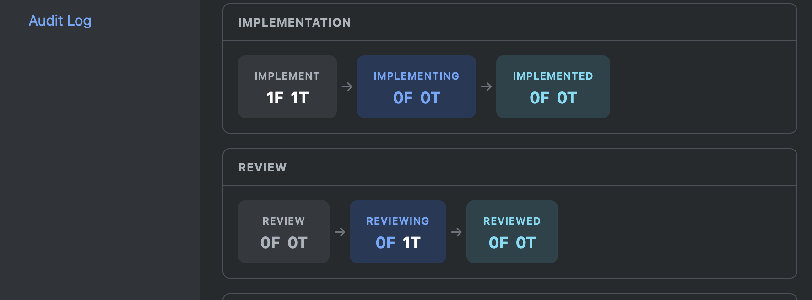 | 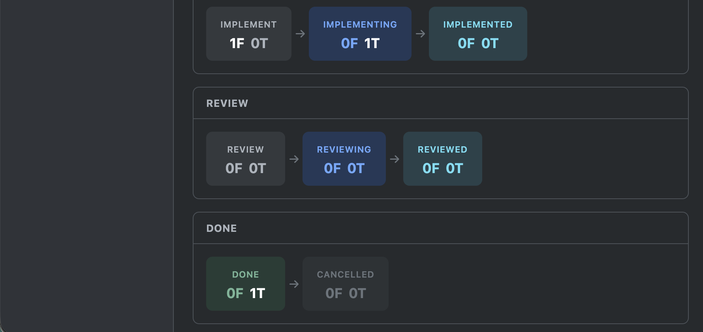 |

When tasks complete, PRs appear on GitHub. Review, merge, and the pipeline advances to done:


The worker continues to the next task automatically. Once all tasks in a feature are done, the feature itself advances through validation and review:

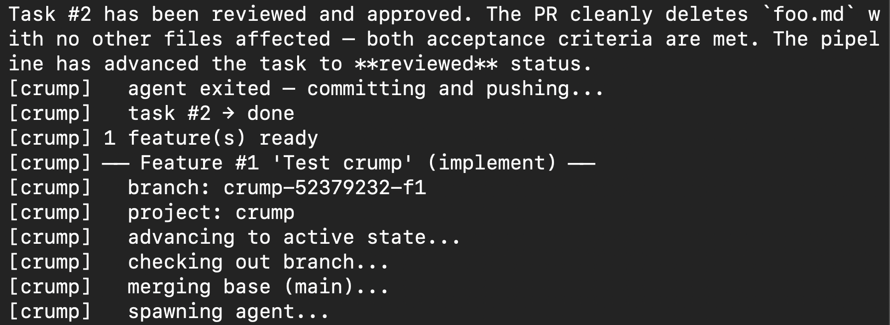


---

## The Pipeline

Both tasks and features flow through three phases:

| Phase | Pending | Active | Complete | What happens |
|-------|---------|--------|----------|-------------|
| **Refine** | `refine` | `refining` | `refined` | Research codebase, write requirements |
| **Implement** | `implement` | `implementing` | `implemented` | Create branch, write code, add tests |
| **Review** | `review` | `reviewing` | `reviewed` | Open PR, review, merge |

A new task starts in `draft`. After all phases complete, it moves to `done`.

### Who does what

| Transition | Responsibility |
|---|---|
| `draft` -> `refine` | Server pipeline (automatic gate) |
| `refine` -> `refining` | Agent loop (picks up, starts work) |
| `refining` -> `refined` | Agent (signals completion) |
| `refined` -> `implement` | Server pipeline (automatic gate) |
| `implement` -> `implementing` | Agent loop (picks up, creates branch) |
| `implementing` -> `implemented` | Agent (signals completion with summary) |
| `implemented` -> `review` | Server pipeline (automatic gate) |
| `review` -> `reviewing` | Agent loop (picks up, opens PR) |
| `reviewing` -> `reviewed` | Server (detects PR merge) |
| `reviewed` -> `done` | Server pipeline (merges PR, cleans up) |

### Features

Features group related tasks. A feature has its own pipeline:

1. **Refine** - lead agent breaks the feature into tasks
2. **Implement** - waits for all tasks to complete, then validates the feature branch
3. **Review** - opens a feature PR to main, reviews combined changes

Task PRs merge into the **feature branch**. The feature PR merges into **main**.

### Git branching

```
main
  |-- crump-{uid}-f{feature_id}              # feature branch
        |-- crump-{uid}-f{fid}-t{task_id_1}  # task branch
        |-- crump-{uid}-f{fid}-t{task_id_2}  # task branch
```

Standalone tasks (no feature) branch directly from main: `crump-{uid}-t{task_id}`

---

## Parallel Workers

Run multiple workers with separate git checkouts for faster execution:

```
~/agent-work/
  instance-1/your-project/    # Worker 1
  instance-2/your-project/    # Worker 2
  instance-3/your-project/    # Worker 3
```

Each worker joins the same server and gets assigned different tasks. Tasks are first-come-first-served - once a worker picks up a task, no other worker touches it.

```bash
# For each instance:
cd ~/agent-work/instance-N/your-project
crump workspace join    # paste the same token
crump agent start       # select Loop Worker
```

---

## Commands

```bash
# Server setup
crump workspace init          # Create workspace (interactive wizard)
crump workspace project       # Add/remove GitHub repositories
crump workspace token         # Generate join token for clients
crump server start            # Start the server

# Client setup
crump workspace join          # Connect to server using token

# Agents
crump agent start             # Start an agent (interactive setup)
crump agent list              # List configured agents

# Dashboard
crump webserver               # Start web dashboard (localhost:8080)

# Direct commands
crump exec '<json>'           # Execute JSON protocol commands
crump <entity> <action> [--args]  # Direct entity commands
```

### Entity actions

```bash
# Create a task
crump exec '{"entity":"task","action":"draft","data":{"title":"Add login","feature_id":1,"component_id":2}}'

# Move to any state
crump exec '{"entity":"task","action":"move","data":{"id":1,"target":"implement"}}'

# Signal implementation done
crump exec '{"entity":"task","action":"implemented","data":{"id":1,"summary":"Added JWT auth"}}'

# Block a task
crump exec '{"entity":"task","action":"block","data":{"id":1,"reason":"Waiting for API spec"}}'

# Or use CLI directly
crump task draft --title "Add login page"
crump task list
crump task get --id 1
```

---

## Built-in Agents

| Agent | Permission Mode | Purpose |
|-------|----------------|---------|
| `crump-lead` | `acceptEdits` | Interactive planning - create features, tasks, write requirements |
| `crump-worker` | `bypassPermissions` | Automated execution - write code, run tests, signal completion |

Custom agents can be added via `crump agent add`.

---

## Documentation

- [Installation](docs/installation.md) - full setup for all platforms
- [How It Works](docs/how-it-works.md) - pipeline, state machine, git operations, prompt generation
- [Plugin Structure](docs/plugin-structure.md) - what's in the Claude Code plugin
- [Updating](docs/updating.md) - how to update binary and plugin

---
